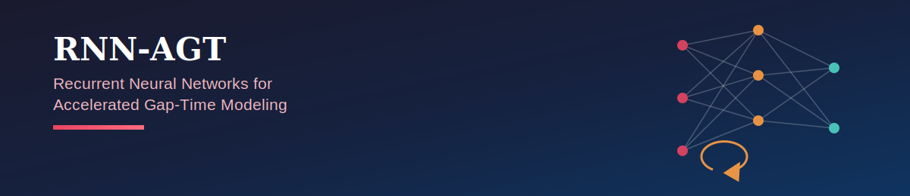
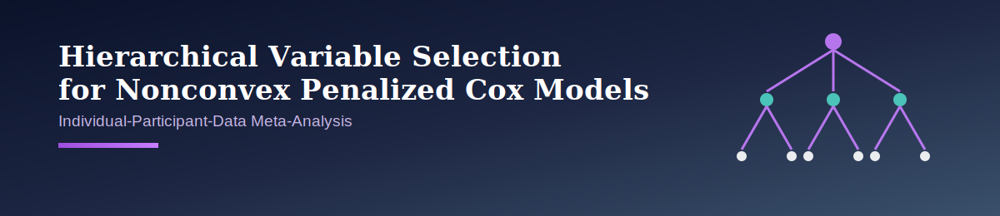

<div align="center">

# 📚 Research Papers
### Statistical & Machine Learning Methods for Time-to-Event Data


*A collection of research papers on modeling time-to-event and recurrent-event data — spanning semiparametric theory, deep learning, and high-dimensional meta-analysis.*

</div>

---

## 📋 Table of Contents

| # | Paper | Methods |
|---|-------|---------|
| 1 | [Efficient Estimation in Semiparametric Accelerated Gap-Time Models](#-paper-1--efficient-estimation-in-semiparametric-accelerated-gap-time-models-for-recurrent-event-data) | Semiparametric Theory · Effective Age · Efficient Score |
| 2 | [RNN-AGT: Recurrent Neural Networks for Accelerated Gap-Time Models](#-paper-2--rnn-agt-a-recurrent-neural-network-framework-for-accelerated-gap-time-models) | Deep Learning · Recurrent Events · Gehan Loss |
| 3 | [Hierarchical Variable Selection for Nonconvex Penalized Cox Models in IPD Meta-Analysis](#-paper-3--hierarchical-variable-selection-for-nonconvex-penalized-cox-models-in-ipd-meta-analysis) | SCAD/MCP · Stratified Cox · Genomics |

---

## ⏱️ Paper 1 — Efficient Estimation in Semiparametric Accelerated Gap-Time Models for Recurrent Event Data


**Emmanuel Djegou¹** ([ORCID](https://orcid.org/0009-0007-5527-2301)) · **Xuerong Meggie Wen¹** ([ORCID](https://orcid.org/0009-0007-8739-5242)) · **Akim Adekpedjou¹** ([ORCID](https://orcid.org/0000-0001-9584-4297))
<br>¹ Department of Mathematics and Statistics, Missouri University of Science and Technology, United States
<br>Corresponding author: `akima@mst.edu`

### Abstract

> The **accelerated failure time (AFT)** model relates covariates to log-transformed event times under right-censoring, and extends naturally to recurrent events through the **accelerated gap-time (AGT)** formulation — a meaningful alternative to the Cox model. In applications like reliability engineering and biomedical research, interventions between successive events can alter subsequent timing, motivating models that explicitly accommodate such effects.
>
> This paper considers a broad class of **semiparametric accelerated gap-time models** incorporating an **effective age process**, representing a wide range of intervention mechanisms within a unified framework. To handle the estimation challenges posed by an infinite-dimensional baseline hazard and non-monotone score functions, a **sample-based weighted efficient score** is constructed via parametric submodels. The resulting estimators are shown to be **consistent and asymptotically normal**, and are illustrated through simulation studies and an application to a biomedical dataset.

**Keywords**
<br>


---

## 🔁 Paper 2 — RNN-AGT: A Recurrent Neural Network Framework for Accelerated Gap-Time Models



**Emmanuel Djegou¹** ([ORCID](https://orcid.org/0009-0007-5527-2301)) · **Akim Adekpedjou¹** ([ORCID](https://orcid.org/0000-0001-9584-4297)) · **Xuerong Meggie Wen¹** ([ORCID](https://orcid.org/0009-0007-8739-5242))
<br>¹ Department of Mathematics and Statistics, Missouri University of Science and Technology, United States
<br>Corresponding author: `emmanueldjegou5@gmail.com`

### Abstract

> Recurrent event data arise when the same type of outcome occurs repeatedly for a subject over time — repeated hospitalizations, successive equipment failures, recurring insurance claims. Standard models often rely on restrictive assumptions about how covariates influence event risk, and can falter when those assumptions break down or relationships are complex.
>
> This paper introduces **RNN-AGT**, a deep learning framework that predicts the time between successive recurrent events in a flexible, data-driven way. An **RNN architecture** learns how a subject's event history shapes future event timing — without parametric assumptions on the error distribution or linearity requirements on covariate effects. To handle subjects whose follow-up ends before all events are observed, training uses a **rank-based (Gehan-type) objective** that properly accounts for incomplete observations while staying computationally efficient.
>
> Extensive simulations — covering nonlinear covariate effects, complex within-subject dependence, varying incomplete follow-up, and high-dimensional predictors — plus applications to **two clinical datasets** (repeated infections and hospital readmissions) show strong predictive accuracy and discrimination, outperforming classical competitors on the larger dataset.

**Keywords**
<br>


---

## 🧬 Paper 3 — Hierarchical Variable Selection for Nonconvex Penalized Cox Models in IPD Meta-Analysis



**Emmanuel Djegou¹** ([ORCID](https://orcid.org/0009-0007-5527-2301)) · **Bertin Dehigbe²** · **Jarrad Botchway¹**
<br>¹ Missouri University of Science and Technology, United States &nbsp;·&nbsp; ² University of Abomey-Calavi, Benin
<br>\* Corresponding author: `emmanueldjegou5@gmail.com`

### Abstract

> High-dimensional IPD meta-analysis for single-event survival outcomes faces two intertwined challenges: between-study heterogeneity in covariate effects, and reliable variable selection when the predictor count is large relative to (but still below) the per-study sample size, under right-censoring. Existing penalized approaches either ignore heterogeneity through naïve pooling, or model it without enforcing coherent sparsity across studies.
>
> This paper proposes an **additive hierarchical penalized framework** for stratified Cox models, where each study keeps its own baseline hazard and coefficients decompose into a **shared global effect** plus **study-specific deviations**. The structured group penalty ensures that exclusion at the global level propagates to all studies, while the explicit shared/study-specific split makes heterogeneity directly interpretable. **SCAD** and **MCP** penalties are incorporated to reduce shrinkage bias relative to LASSO and Elastic Net. The estimators are shown to achieve **variable-selection consistency** and **oracle efficiency** as dimension grows with sample size.
>
> Across thirteen simulation scenarios varying correlation, censoring, heterogeneity, signal strength, and dimensionality, the **hierarchical MCP** approach achieves the best overall selection performance. An application to multi-cohort genomic survival data identifies stable prognostic biomarkers and interpretable cross-study heterogeneity patterns.

**Keywords**
<br>


---

## 🔗 How the Papers Connect

```
Paper 1 (Semiparametric AGT + Effective Age)  ──►  theoretical foundation
                                                       │
Paper 2 (RNN-AGT: Deep Learning extension)     ◄───────┘  relaxes parametric
                                                          assumptions via RNNs
Paper 3 (Hierarchical Nonconvex Cox / IPD)    ──►  parallel high-dimensional
                                                    variable-selection track
                                                    for single-event survival
                                                    data across multiple cohorts
```

Papers 1 and 2 form a direct progression: the semiparametric AGT theory establishes efficient estimation for effective-age-driven recurrent event models, and RNN-AGT relaxes those parametric assumptions using recurrent neural networks. Paper 3 addresses a related but distinct challenge — robust, interpretable variable selection in high-dimensional, multi-cohort single-event survival data.

<div align="center">

---

*For preprints, code, or collaboration inquiries, please contact the corresponding authors listed above.*

</div>
